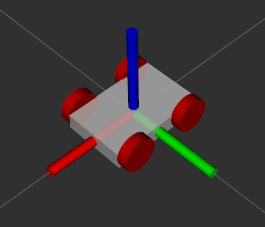
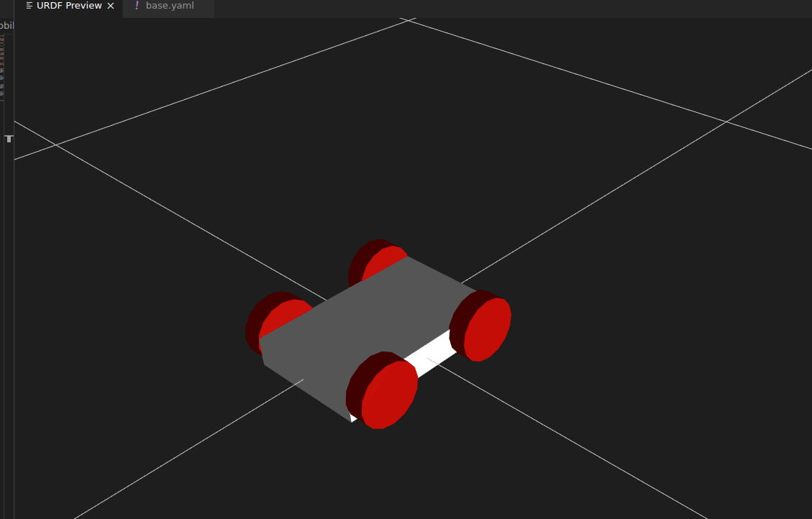

<div align="center">
  
  
  # Mobile Robot Complete Build Guide
  
  **A complete guide for the physical build of the Mobile Robot, including hardware connections and wiring.**
</div>

---

## 📖 Overview
This repository contains the complete documentation and advanced ROS workspace code for building a 4WD ROS-based mobile robot. It covers both the physical hardware assembly and the advanced ROS software integration including SLAM, Navigation, and Hardware interface.

## 🔌 Wiring & Hardware Connections

| Component | Pin / Port | Connected To |
| :--- | :--- | :--- |
| **Teensy 4.0** | USB | Raspberry Pi 4 |
| **Slamtec LIDAR** | USB | Raspberry Pi 4 |
| **Left Encoder** | Pins 5 & 6 | Teensy 4.0 |
| **Right Encoder** | Pins 7 & 8 | Teensy 4.0 |
| **Motor Driver (I2C)** | Pins 18 (SDA), 19 (SCL) | Teensy 4.0 |
| **Motors** | Motor Driver Output | Motor Driver |

<div align="center">
  <br>
  
  <br>
</div>

## 🚀 Quick Start
To get started with this project, clone the repository and build your ROS workspace.

```bash
git clone https://github.com/praveenkumar3911/mobile_robot_full_guide.git
cd mobile_robot_full_guide
catkin_make
```